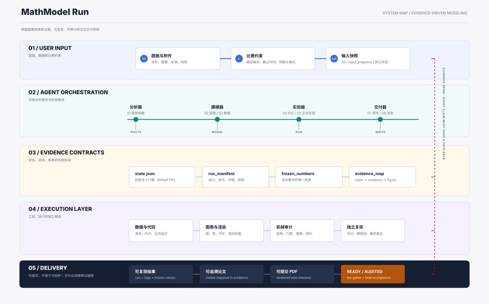
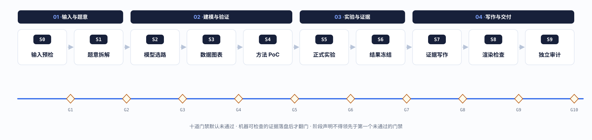

<p align="center">
  
</p>

<p align="center">
  
</p>

<p align="center">
  <strong>把题面推进成有证据的论文。</strong><br>
  十阶段、十门禁、默认失败、独立复核、结果冻结、逐页渲染、最终审计。
</p>

<p align="center">
  <a href="LICENSE"></a>
  <a href="https://www.python.org/"></a>
  
  
  <a href="my-mathmodel-agent/SKILL.md"></a>
</p>

<p align="center">
  <a href="index.html">交互式作战地图</a> ·
  <a href="my-mathmodel-agent/SKILL.md">Codex Skill</a> ·
  <a href="docs/WORKFLOW.md">中文执行说明</a> ·
  <a href="docs/INSTALL.md">安装</a>
</p>

---

## 工作流总览

<p align="center">
  
</p>

每一条边都是一个**门禁**：只有当机器可检查的证据落盘，门禁才会从 `false` 翻成 `true`，阶段才允许前进。声明的阶段不允许领先于第一个未通过的门禁——机械审计会直接判 FAIL。

## 为什么需要它

数学建模比赛不是"先选一个高级模型，再把论文写满"的过程。真正容易失控的是：

- 题意没有拆清，模型答错了问题；
- 数据单位、来源或切分口径混乱；
- 代码能跑，但结果无法复现；
- 论文引用了旧聊天里的数字；
- 图和表很好看，但无法证明结论；
- 最终 PDF 编译成功，却没人逐页检查。

MathModel Run 把比赛拆成一条可恢复的证据链：**输入 → 拆题 → 选路 → 数据 → PoC → 实验 → 冻结 → 写作 → 渲染 → 审计**。每个阶段都有机器产物，任何门禁默认未通过，只有独立复核后才能翻门。

## 核心机制

| 机制 | 数模含义 |
|---|---|
| 十阶段状态机 | 禁止从"大概思路"跳到最终论文 |
| 默认失败门禁 | 子问题、模型路线、图表、运行、论文默认 `false` / `pending` |
| 阶段-门禁绑定 | `stage` 声明不得领先于第一个 `false` 门禁，机械审计强制执行 |
| baseline → primary → fallback | 每个子问题都有可解释对照和退路 |
| 证据对象 | command、test、data、figure、log、manual 六类，kind/value/path 机器校验 |
| 结果冻结 | 论文数字只能来自 `frozen_numbers.json`，source_run 必须登记在 run_manifest |
| 决策日志 | KEEP / CUT / DEFER / PIVOT / ACCEPT_RISK 只追加、不改历史 |
| 独立评分 | 10 个维度 0-5 分，硬底线不达标不能通过 |
| 原位更新 | 更新文件时替换原路径，不保留隐藏旧版本 |

## 快速开始

### 1. 新建一个比赛项目

```bash
python3 my-mathmodel-agent/scripts/init_project.py 2026-cumcm-a
```

生成的项目自带完整证据骨架：

```text
2026-cumcm-a/
├── problem_files/                  # 官方题面和附件
├── planning/
│   ├── problem_analysis.json       # 每问默认失败的任务卡
│   └── decision_log.jsonl          # 追加式决策日志
├── methods/
│   ├── model_route.json            # baseline / primary / fallback
│   └── method_validation.json      # PoC 与验证证据
├── data_cleaned/data_plan.json     # 字段、单位、清洗、泄漏检查
├── figures/visualization_plan.json # 图表目的与生成脚本
├── code/                           # Python / AMPL PoC 与正式代码
├── results/run_manifest.json       # 可复现运行记录
├── paper/
│   ├── evidence_map.json           # claim → 证据映射
│   └── render_log.json             # PDF 编译和逐页检查
├── audit/
│   ├── gate_evidence.json          # 每个门禁的证据
│   └── acceptance.json             # 独立审查结果
├── input_manifest.json             # 输入路径、哈希和来源
├── frozen_numbers.json             # 论文数字冻结文件
├── state.json                      # 当前阶段与十门禁
└── PROGRESS.md                     # 跨上下文交接日志
```

### 2. 查看当前应做什么

```bash
python3 my-mathmodel-agent/scripts/status.py 2026-cumcm-a
```

输出会列出十个门禁、第一个未通过门禁、由门禁推导的权威下一步，并在手写的 `next_action` 过期时给出漂移提醒：

```text
Project: 2026-cumcm-a
Stage:   PREFLIGHT
Status:  not_started
Gates:   0/10 passed
  OPEN input_snapshot
  OPEN problem_decomposed
  ...

Next:    inspect_problem_files_and_record_hashes
Gate:    input_snapshot
Missing artifacts: none
```

### 3. 检查本机环境

```bash
python3 my-mathmodel-agent/scripts/doctor.py
```

### 4. 冻结最终数字

结果文件中的每个值必须包含：

```json
{
  "name": "CO2_2021",
  "value": 414.2,
  "unit": "ppm",
  "source_file": "results/runs/run-003/metrics.json",
  "source_run": "run-003",
  "subproblem": "Q1",
  "notes": "annual global mean; verified against original data"
}
```

然后执行：

```bash
python3 my-mathmodel-agent/scripts/freeze_numbers.py   results/verified_results.json   --output 2026-cumcm-a/frozen_numbers.json
```

### 5. 机械审计

```bash
python3 my-mathmodel-agent/scripts/audit_workspace.py 2026-cumcm-a
```

`INCOMPLETE` 表示还没走完；`FAIL` 表示已声称通过但证据或契约有问题；`MECHANICAL_PASS` 只说明结构、门禁和溯源通过，最终 `READY` 仍要求独立审查者写出 `audit/final_report.md`。

## 机械审计清单

`audit_workspace.py` 对每一个声称为 `true` 的门禁强制执行：

| 检查 | 规则 |
|---|---|
| 结构 | 9 个目录、15 个契约文件必须存在 |
| 阶段诚实 | `stage` 不得领先于第一个 `false` 门禁；全部门禁通过必须是 `READY` |
| 门禁证据 | `true` 门禁在 `gate_evidence.json` 必须有非空证据数组 |
| 证据形状 | `kind` 必须是六种之一；`value` 非空；引用的 `path` 必须存在 |
| 冻结溯源 | schema 2.0、冻结时间、源哈希、每值七字段齐全 |
| 冻结 ↔ 运行 | `source_run` 必须在 `run_manifest.json` 登记；`source_file` 必须存在 |
| 论文 ↔ 冻结 | `evidence_map.claims` 非空；每个 claim 有证据；`frozen_numbers.json#name` 必须可解析 |
| 选路 | `model_route.subproblems` 每项有 `acceptance_criteria` |
| 渲染 | `pdf_verified` 要求每页 `checked: true` |
| 决策日志 | 每行合法 JSON；分类限 KEEP/CUT/DEFER/PIVOT/ACCEPT_RISK；带时间戳和主题 |
| READY | 十门禁全 `true` + `final_report.md` + `acceptance.verdict=pass` |

## 十阶段

| 阶段 | 主要产物 | 门禁 |
|---|---|---|
| S0 输入预检 | `input_manifest.json` | `input_snapshot` |
| S1 题意拆解 | `planning/problem_analysis.json` | `problem_decomposed` |
| S2 模型选路 | `methods/model_route.json` | `model_route_selected` |
| S3 数据图表 | `data_plan.json` + `visualization_plan.json` | `data_plan_ready` |
| S4 方法 PoC | `method_validation.json` + PoC 代码 | `method_validated` |
| S5 正式实验 | `run_manifest.json` + 日志 + 图表 | `experiments_reproduced` |
| S6 结果冻结 | `frozen_numbers.json` | `results_frozen` |
| S7 证据写作 | 论文 + `evidence_map.json` | `paper_written` |
| S8 渲染检查 | PDF + `render_log.json` | `pdf_verified` |
| S9 独立审计 | `acceptance.json` + `final_report.md` | `audit_passed` |

完整输入、出口标准、失败回退见 [my-mathmodel-agent/references/workflow-contract.md](my-mathmodel-agent/references/workflow-contract.md)。

## 文档入口

| 文件 | 用途 |
|---|---|
| [index.html](index.html) | 交互式起始页面和作战地图 |
| [my-mathmodel-agent/SKILL.md](my-mathmodel-agent/SKILL.md) | Codex skill 总入口 |
| [my-mathmodel-agent/references/workflow-contract.md](my-mathmodel-agent/references/workflow-contract.md) | 十阶段详细契约 |
| [my-mathmodel-agent/references/artifact-contracts.md](my-mathmodel-agent/references/artifact-contracts.md) | JSON 产物字段规范 |
| [my-mathmodel-agent/references/evaluation-rubric.md](my-mathmodel-agent/references/evaluation-rubric.md) | 独立审查评分表 |
| [docs/WORKFLOW.md](docs/WORKFLOW.md) | 中文执行说明 |
| [docs/INSTALL.md](docs/INSTALL.md) | 安装与环境诊断 |
| [docs/CONTRIBUTE.md](docs/CONTRIBUTE.md) | 贡献指南 |
| [AGENTS.md](AGENTS.md) | 文件原位更新规则 |
| [AGENT_PROMPT.md](AGENT_PROMPT.md) | 可直接给 Agent 使用的系统提示词 |

## 真实案例

已接入第一道可追溯试题：[HiMCM 2022 Problem B：CO2 与全球变暖](examples/himcm-2022-problem-b/)。
案例保留本地数据、历史 working draft 和既有图表，同时用十门禁明确区分“已有素材”和“已独立复现”。当前已完成输入快照、题意拆解、模型选路和数据计划，停在 `method_validated`，下一步是补充可运行的独立复现脚本。

## 文件更新规则

用户要求更新、修改或重写某个文件时：

1. 在原路径更新当前版本；
2. 删除该文件中的旧内容；
3. 如存在代表同一文档的旧副本，一并删除；
4. 结束前确认再次打开原路径只会看到当前版本；
5. 除非用户明确要求，不保留 `v1`、`v2`、backup 或旧稿目录。

## 仓库自检

```bash
python3 scripts/validate_repo.py
python3 tests/test_smoke.py
```

预期输出：

```text
validate_repo: repository is release-ready
All smoke tests passed.
```

## 许可

[MIT](LICENSE)
